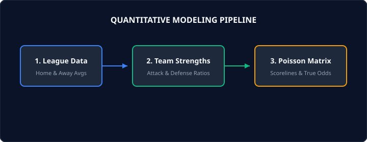

# Poisson Distribution in Football Betting: Step-by-Step Practical Modeling

Poisson distribution is one of the foundational statistical frameworks used by professional betting syndicates and quantitative analysts to model football match outcomes. In this comprehensive guide, we will break down the mathematical mechanics of Poisson modeling, demonstrate how to calculate home and away expected goals, and derive fair market probabilities for 1X2, Over/Under, and Both Teams to Score markets.



## Why Poisson Works for Football

In mathematical terms, the Poisson distribution expresses the probability of a given number of events occurring in a fixed interval of time or space if these events occur with a known constant mean rate and independently of the time since the last event.

Football fits these criteria reasonably well:
1. Goals are discrete events ($0, 1, 2, 3...$)
2. An 90-minute football match represents a constant time interval
3. The average scoring rate across top European leagues hovers around $2.6$ to $2.9$ goals per match

While football is not 100% Poisson-distributed due to game-state dynamics (teams behave differently when trailing or protecting a lead), it remains the gold-standard baseline from which quantitative models operate.

## Step 1: Calculating League Averages

To begin, calculate the average goals scored at home and away across the entire competition over a representative sample (usually 2 to 3 seasons).

For example, in the English Premier League:
- **Total Home Goals / Total Matches** = Average Home Goals Per Match (typically $\approx 1.52$)
- **Total Away Goals / Total Matches** = Average Away Goals Per Match (typically $\approx 1.25$)

## Step 2: Determining Attack & Defense Strengths

Next, calculate the attack and defense strength for each team relative to the league averages.

- **Attack Strength (Home)**: Team's average home goals scored divided by League average home goals.
- **Defense Strength (Away)**: Team's average away goals conceded divided by League average away goals.

```text
Expected Home Goals = Home Team Attack Strength × Away Team Defense Strength × League Home Average
Expected Away Goals = Away Team Attack Strength × Home Team Defense Strength × League Away Average
```

## Step 3: Generating the Scoreline Matrix

With the expected goal rates ($\lambda_{home}$ and $\lambda_{away}$), we apply the Poisson formula:

$$P(k \text{ goals}) = \frac{\lambda^k e^{-\lambda}}{k!}$$

By computing the joint probability of every scoreline up to $5 \times 5$, you can sum all probabilities where:
- **Home Goals > Away Goals**: Home Win probability
- **Home Goals = Away Goals**: Draw probability
- **Home Goals < Away Goals**: Away Win probability

Compare these fair probabilities with bookmaker implied probabilities ($\frac{1}{\text{Decimal Odds}}$) to uncover positive expected value (+EV) betting opportunities.
